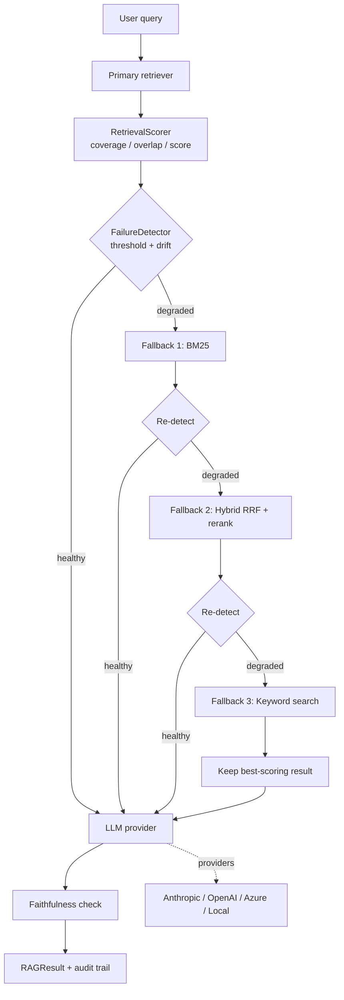
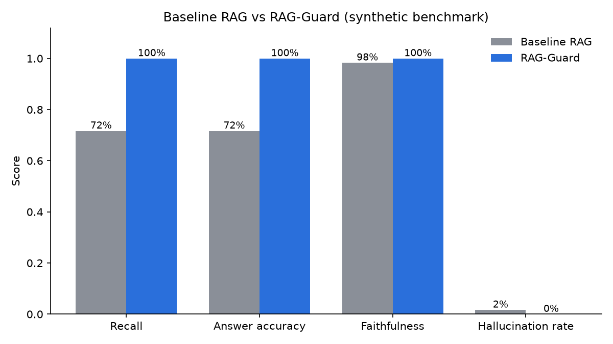

# RAG-Guard

**Detect silent retrieval failures in RAG pipelines and recover *before* the LLM answers.**


## The problem

Production RAG systems rarely crash; they **degrade silently**. An embedding model is upgraded, an index goes stale, or a query is phrased unusually, and the retriever returns plausible but wrong chunks. The LLM then writes a fluent answer from bad context. Evaluation tools (Ragas, DeepEval) tell you about this *after the fact*, in batch. Nothing sits in the request path to stop it.

RAG-Guard puts a quality gate between retrieval and generation:

1. **Score** retrieved chunks with label-free signals (query-term coverage, best-chunk overlap, retriever score).
2. **Detect** degradation using an absolute threshold plus a rolling-baseline drift check.
3. **Recover** by escalating through fallback strategies (BM25, hybrid RRF + rerank, broad keyword search) with timeouts and exponential-backoff retries, keeping the best result seen.
4. **Generate** through a provider-agnostic LLM layer (Anthropic, OpenAI, Azure OpenAI, local OpenAI-compatible servers).
5. **Audit**: every answer carries the strategies tried, scores, cost, latency, and a faithfulness check.

## Architecture



Layers: `detection/` (scoring, detector, faithfulness) · `retrieval/` (strategies, reranker, fallback chain) · `llm/` (httpx-based providers) · `orchestration/` (pipeline, state log, adaptive recovery) · `evaluation/` (dataset, metrics, benchmark) · `api/` (FastAPI).

## Quickstart

```bash
git clone https://github.com/kolipakamahendra1-wq/rag-guard.git && cd rag-guard
python -m venv .venv && source .venv/bin/activate      # Windows: .venv\Scripts\activate
pip install -e ".[dev]"

pytest --cov=rag_guard          # 91 tests, fully offline
python examples/basic_rag.py    # baseline vs RAG-Guard on one question
python scripts/benchmark.py --out docs
```

### Docker

```bash
docker compose up --build
curl -X POST localhost:8000/query -H 'content-type: application/json' \
     -d '{"query": "What is the replication factor of Torvex?"}'
```

With no API keys set, the service starts in **offline demo mode** (mock LLM over a synthetic corpus). Set `ANTHROPIC_API_KEY` (or `OPENAI_API_KEY`, etc., plus `DEFAULT_LLM_PROVIDER`) to use a real model.

### Library use

```python
from rag_guard.config import Settings
from rag_guard.llm import create_provider
from rag_guard.orchestration.builder import build_pipeline

settings = Settings()
llm = create_provider("anthropic", settings)
pipeline = build_pipeline(my_corpus, llm, settings, primary=my_vector_store_retriever)
result = await pipeline.run("What is our data retention period?")
print(result.answer, result.fallback_used, result.faithfulness)
```

Bring your own backend by subclassing `rag_guard.retrieval.Retriever` (one async `retrieve` method).

## Benchmark results

> **Read this first.** These numbers come from a *synthetic* benchmark: 60 unique fact documents, one question each, a deterministic simulated LLM (`ExtractiveMockLLM`), and a primary retriever whose query embeddings are perturbed with noise to simulate drift. They show how the **pipeline behaves**, not how a real model or a real corpus would perform. The fallback retrievers (BM25) solve this corpus trivially because every entity name is a unique token; real corpora will recover less often. Reproduce with `python scripts/benchmark.py`.

Headline run, embedding-drift noise = 5.0 (primary retriever misses the right document ~28% of the time):

| Metric | Baseline RAG | RAG-Guard | Change |
|---|---|---|---|
| Recall | 71.7% | 100.0% | +39.5% |
| Answer accuracy | 71.7% | 100.0% | +39.5% |
| Faithfulness | 98.3% | 100.0% | +1.7% |
| Hallucination rate | 1.7% | 0.0% | -100.0% |
| Latency p50 (ms, in-process) | 4.21 | 4.10 | -2.6% |
| Latency p95 (ms, in-process) | 5.38 | 5.44 | +1.2% |
| Cost / query (USD, simulated pricing) | 0.000519 | 0.000518 | -0.2% |
| Recovery success rate | 0.0% (17 degraded) | 100.0% (17 degraded) | n/a |

Sweep across drift levels (full tables in [docs/benchmark_results.md](docs/benchmark_results.md)):

| Drift noise | Baseline recall | RAG-Guard recall | Baseline hallucination | RAG-Guard hallucination |
|---|---|---|---|---|
| 0.0 (healthy) | 100.0% | 100.0% | 0.0% | 0.0% |
| 3.0 | 91.7% | 100.0% | 0.0% | 0.0% |
| 5.0 | 71.7% | 100.0% | 1.7% | 0.0% |
| 8.0 | 43.3% | 100.0% | 16.7% | 0.0% |
| 12.0 | 25.0% | 100.0% | 26.7% | 0.0% |

With no drift, RAG-Guard adds no cost and triggers no fallbacks. Latency is in-process with mock I/O, so it reflects pipeline overhead only (milliseconds), not network time.



### Known limitations

- **Faithfulness is not correctness.** The faithfulness metric checks that an answer is supported by the retrieved context. When retrieval returns a *different but similar* document (e.g. another entity with the same attribute), the answer can be faithful and still wrong. Recall and answer accuracy catch this; faithfulness does not. `examples/basic_rag.py` shows it.
- **Detection is heuristic and label-free.** Coverage and overlap signals can be fooled when a wrong chunk shares the query's vocabulary. A learned cross-encoder or an LLM judge would be stronger, at higher cost and latency.
- **Faithfulness uses lexical overlap**, not entailment.
- **The benchmark is synthetic**; no real-LLM or real-corpus evaluation is included yet.

## Design trade-offs & decisions

- **No LangChain/LangGraph.** The control flow is small (retrieve, detect, escalate, generate), and an explicit `FallbackChain` is easier to test, trace, and reason about than a graph framework. The cost: no ecosystem integrations out of the box.
- **Providers speak HTTP via `httpx`, not vendor SDKs.** One thin base class, injectable client, and `httpx.MockTransport` make every provider testable offline with real request/response shapes. The cost: new API features (streaming, tool-use details) must be added by hand. `stream_generate` currently streams a completed response word by word rather than using server-sent events.
- **Label-free detection before generation.** Gating on query/chunk signals catches bad retrieval without ground truth and before paying for an LLM call. The cost: false positives and false negatives that a learned model would reduce.
- **Keep the best attempt, don't blindly take the last.** Fallbacks can be worse than the primary; the chain returns the highest-scoring result and stops early once quality recovers, which bounds cost.
- **Failures degrade, they don't raise.** A failing backend or LLM becomes an audited `RAGResult(success=False, error=...)`; one dead retriever never aborts the chain. Retries apply only to transient errors (429, 5xx, network); 4xx fails fast.
- **Deterministic everything.** Hashed embeddings, seeded-by-query noise, sequential benchmark runs: results reproduce exactly, so CI can assert on behaviour instead of tolerating flakiness.
- **`AdaptiveRecovery` is intentionally simple**: it reorders fallback stages by observed success rate. It does not condition on query type; that is a roadmap item.

## Project layout

```
src/rag_guard/   detection/ retrieval/ llm/ orchestration/ evaluation/ api/ utils/
src/mocks/       deterministic LLM and retriever test doubles
tests/           unit/ integration/ benchmarks/   (91 tests, no network)
docs/            PRD.md, ARCHITECTURE.md, benchmark_results.{md,png}
```

## License

MIT. See [LICENSE](LICENSE).
